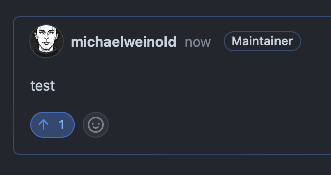

# Group Formation ("Vote!")

We have drowned you in theoretical knowledge and source code (sorry). \
Now it is time to apply it!

Remember: In the [Brightway](https://docs.brightway.dev/en/latest/) and [Premise](https://premise.readthedocs.io/en/latest/index.html) ecosystem, you have tools available for:

 - cloud calculations
 - uncertainty and sensitivity assessment
 - parametric modelling
 - interfaces to external models
 - inclusion of spatial and temporal information
 - generation of new databases for scenarios and prospective LCA
 - hybridization of multiple databases
 - database modelling perspectives

If you want, you can even create a standalone interactive online visualization tool with [HoloViz Panel](https://panel.holoviz.org).

## Propose YOUR Projects

### 30 MINUTES

1. __IF YOU ALREADY HAVE A PROJECT IDEA__, please [create a new "IDEA" Discussion in the DdS Spring School repository](https://github.com/Depart-de-Sentier/Spring-School-2024/discussions/new?category=ideas).
2. __IF YOU WANT TO BRAINSTORMING A NEW PROJECT IDEA__, please move to the "discussion table" and discuss it with your peers. If you think your idea is worth pursuing, please create a new "IDEA" Discussion in the DdS Spring School repository (see above).
3. __IF YOU WANT TO CONTRIBUTE TO ANOTHER PROJECT IDEA__, please roam around the main room and see if you can find a project that you would like to contribute to.

## Present YOUR Projects

### 15+ MINUTES

Every project will have __2 MINUTES__ to present their idea. \

## How to vote for Projects

We will be able to support 4 projects. \
[Please vote for the projects you would like to work on](https://github.com/Depart-de-Sentier/Spring-School-2024/discussions/categories/ideas) (you can vote for multiple projects):

